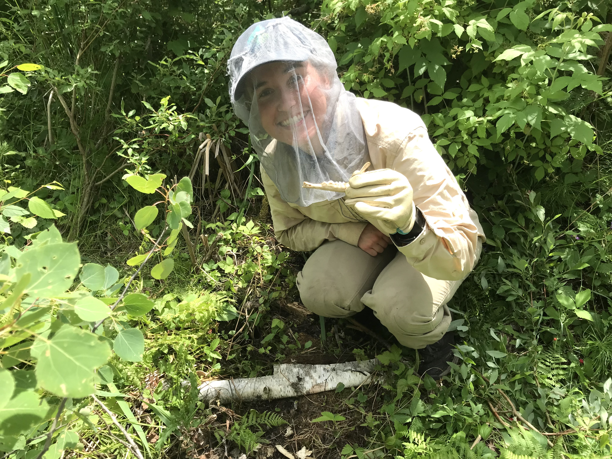

Fall 2020-Spring 2021: Savannah River Ecology Lab

I worked as a Research Technician for the University of Georgia's SREL lab on their wild pig project. The majority of my time here I spent prepping and managing 240 baited camera stations, as well as set and maintained net and corral traps. I also had the opportunity to assist current graduate students with their fieldwork, which included wood duck nest box surveys and scavenger studies.

Summer 2021: Bald Head Island Conservancy

I spent this summer as a sea turtle nighttime tagging intern. As the job title suggests, I worked a completely nocturnal schedule (9pm-6am) patrolling the beach and looking for nesting moms. When a mama turtle came up on shore and begun to dig her nest, we would PIT and flipper tag her, measure her carapace (shell), and get biopsies from her back flipper. Towards the end of July/beginning of August, we would begin to monitor the marked turtle nests for hatchlings and would excavate the nest after 70 days of when it was initially laid. During my time here, I also conducted and presented an individual research project on coyote movement and depredation on sea turtle nests.

Fall 2021-Spring 2022: Southern Illinois University

I worked as a Carnivore Research Technician on a graduate student's research project studying gray fox occupancy. I deployed and maintained trail cameras in gray fox habitat, as well as conducted habitat surveys.

Spring 2022-Fall 2022: Voyageurs Wolf Project

I spent 7 months up in northern Minnesota working as a wolf research technician, which consisted of some of my hardest and most rewarding days I've ever experienced. With this project, I had a plethora of duties ranging from processing and collaring gray wolves, investigating wolf clusters and kill sites, maintaining trail cameras, conducting howl surveys, processing biological data, cataloging video data and performing habitat surveys, all while battling the unforgiving environment and swarms of hellish bugs.

Winter 2022- Spring 2023: Southern Illinois University

I returned to SIU after my Voyageurs stint to work on a coyote and bobcat trapping research study. I was responsible for setting and maintaining my own trap line of cages and footholds with the goal of humanely catching the two target carnivores. With this work, I became very comfortable in drawing and administering chemical immobilizers to the target species, as well as worked on my skills with collaring and processing carnivores during sedation. We hit our quota early in February, so I was switched to the white-tailed deer project and assisted in those captures as well.

Savannah River Site; caught a large mouth bass during a fishing outing

Bald Head Island Conservancy; the turtle team and a morning nester

Voyageurs Wolf Project; investing a fawn kill from breeding male wolf "P0C"

Southern Illinois University; grad student, Abby Weber, and I with "Hiccup" the bobcat

Southern Illinois University; Abbey Weber and I taking "Whiskey" the coyote of his foothold after sedation
