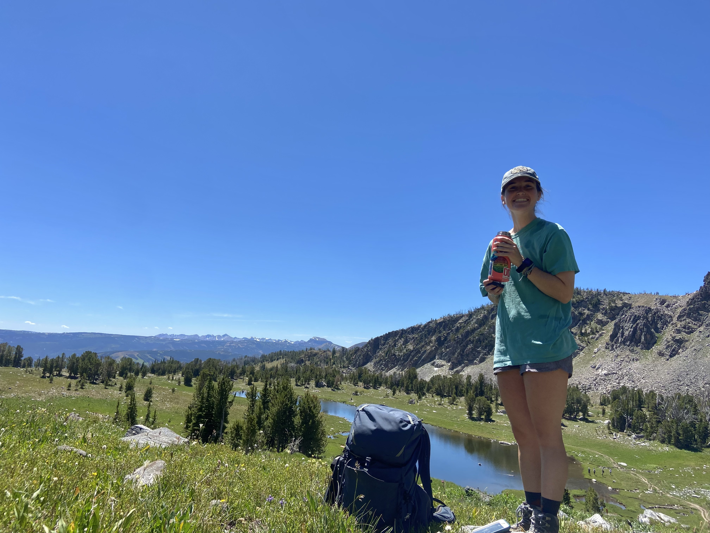

Welcome to my humble online abode!

My name is Clara and I'm a first year M.S student in the NREN department. I'll be studying wildlife corridors and connectivity across the state of New Hampshire, which is fancy jargon for I will be putting out cameras on roads and culverts and seeing what animals utilize them for travel.

I am originally from North Carolina and graduated from NC State in 2020 with a B.S in Zoology and minors in Wildlife Science and Marine Science. After graduating, I spent several years traveling the Midwestern and the Southeastern U.S. working seasonal wildlife stings. Highlights from these jobs include tracking gray wolves in Minnesota, tagging Loggerhead sea turtles in North Carolina and radio collaring coyotes and bobcats in Illinois. When I'm not doing wildlife work, I love running, hiking, playing soccer and card games!

